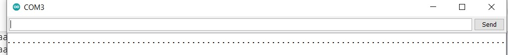

# LEDstrip-Telegram
Hier probeer ik uit te zoeken en uit te leggen hoe je via Telegram een Neopixel LEDstrip kan besturen.

## Wat heb je nodig?
* NodeMCU
* RGB LEDStrip
* USB kabel

## Stap 1 - Aansluiten LEDstrip
- Verbindt draadje 5V met pin 3V3.
- Draadje Din naar D5.
- Draadje GND naar GND.

## Stap 2 - Een Telegram bot aanmaken
- Open de link https://telegram.me/botfather.
- Begin een gesprek met de BotFather.
- Maak een bot aan met "/newbot" en geef het een naam.
- Je krijgt nu een API token, kopieer deze.

## Stap 3 - Code en Libraries importeren
- https://github.com/witnessmenow/Simple-Home-Automation-With-Telegram/tree/master/LedControl Importeer dit project naar Arduino.
- Installeer vervolgens de Adafruit Neopixel en universalTelegramBot Arduino plugins met dependencies onder **Sketch > Include Libraries > Manage Libraries...**.
- Maak nu een hotspot op je mobiel aan en voer je SSID en wachtwoord in de code in.
- Voer ook je API Token in en de juiste LED pin.
- Nu kan je de code uploaden naar je NodeMCU.
- Open de Serial Monitor met een Baud Rate van 115200.
- Als je /start verstuurd naar je bot zou je een reactie moeten krijgen.

Ik kon niet verbinden met m'n hotspot. Ik kwam erachter dat aan het einde van mijn SSID een spatie stond. Check heel goed hoe de string eruit ziet.

## Stap 4 - Code hervormen voor Neopixel
- We moeten de Adafruit Neopixel library includen. Voeg "#include <Adafruit_NeoPixel.h>" toe bij de andere includes.
- Onder je includes: #define PIN *je LED pin*, #define NUM *aantal leds on strip* en Adafruit_NeoPixel pixels(NUM, PIN, NEO_GRB + NEO_KHZ800);
- Om de LEDs aan te zetten plaats je bovenin de setup() function: pixels.begin();

## Bronnen
- https://arduinodiy.wordpress.com/2020/01/06/3838/
- https://www.youtube.com/watch?v=-IC-Z78aTOs&ab_channel=BrianLough
- https://github.com/witnessmenow/Simple-Home-Automation-With-Telegram/tree/master/LedControl
